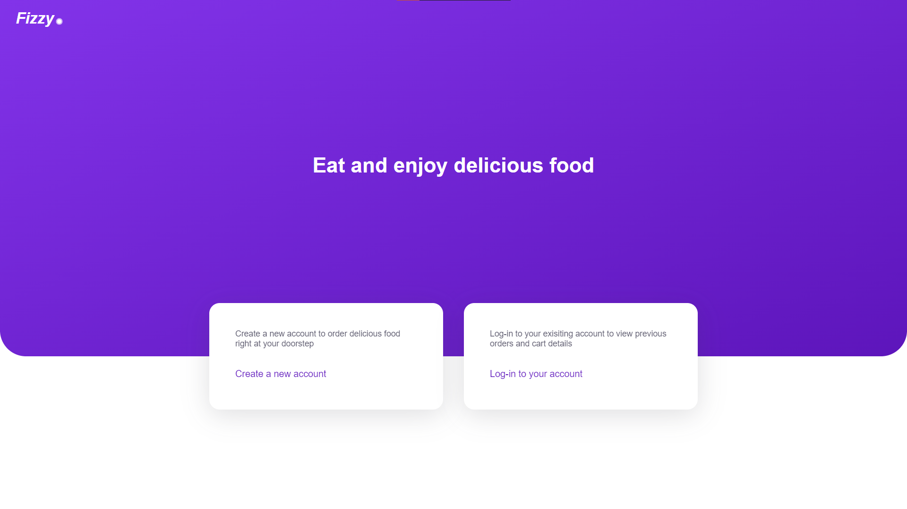

# Cafe Managament System

This cafeteria management system lets you manage orders, customize menus and avail your customers to order online.

## These are some features of the system:

### Customer

- A customer can checkout menus after logging in and add menu items to their cart.
- They can checkout using the cart after reviewing the total amount.

### Owner

- The owner can create menus and add menu items to them. The menu item consists of a name, description and price together with a category.
- The owner can see user infos and checkout all the orders made for management purposes.
- The owner can also assign one or more Billing clerks.

### Billing Clerks

- Billing clerks manages the delivery of the order made online and creating a new order for walkin customers.
- Once the item is delivered, they can mark the order as delivered.

## Checkout the live app

You can visit the app [here](http://devansh-cafe-manager.herokuapp.com/).



From there you can either create a new account or log into your existing account.

### There are some dummy accounts already created for demonstration purposes:

- Owner's Account

  - Email: owner@cafe.com
  - Password: owner

- Customer's Account

  - Email: test@test.com
  - Password: test

Once you login as a customer, you will be shown all the menu items available with their details. From there you can add the menu items to your cart and chekout.

If you login as an Owner, you will be taken to your dashboard, from where you can manage everything.

## Development related details:

Required ruby version: `2.6.3`

## Install

### Clone the repository

```shell
git clone https://github.com/DevanshKaushik/cafeteria-manager.git
cd cafeteria-manager
```

### Install dependencies

Using [Bundler](https://github.com/bundler/bundler):

```shell
bundle
```

### Initialize the database

```shell
rails db:create db:migrate
```

## Serve

```shell
rails s
```
