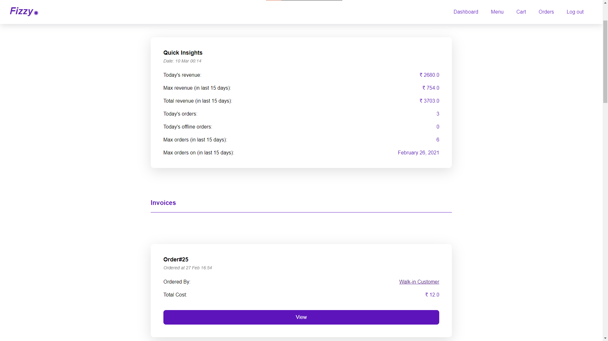

# Cafe Managament System - **_Fizzy_**

Fizzy is a cafeteria management system which lets you manage orders, customize menus and avail your customers to order online.

## Talbe of content

- [Features](#features)<br/>
- [Live App](#live-app)
- [Demonstration](#demonstration)
- [Installation](#install)

## Features

These are the feature of the app

### Customer

- A customer can checkout menus after logging in and add menu items to their cart.
- They can checkout using the cart after reviewing the total amount.
- They can view previous orders and see every detail related to the order and its delivery.

### Owner

- The owner can create menus and add menu items to them. The menu item consists of a name, description and price together with a category.
- They can see user infos and checkout all the orders made for management purposes.
- They can view reports and see individual invoices for the orders made by the customers.
- They can also assign one or more Billing clerks for managing the delivery.

### Billing Clerks

- Billing clerks manages the delivery of the order made online and creating a new order for walkin customers.
- Once the item is delivered, they can mark the order as delivered.

## Live App

You can visit the app [here](http://devansh-cafe-manager.herokuapp.com/).

## Demonstration

This is how you can use the app and manage every aspect of it


This is the homepage of the app from where you can either create a new account or log into your existing account.

### There are some dummy accounts already created for demonstration purposes:

- Owner's Account

  - Email: owner@cafe.com
  - Password: owner

- Clerk's Account

  - Email: clerk@cafe.com
  - Password: clerk

- Customer's Account

  - Email: test@test.com
  - Password: test

### Jump to:

- [Customer's Account](#customer-account)<br/>
- [Clerk's Account](#clerk-account)<br/>
- [Owner's Account](#owner-account)<br/>

<br/>

### Customer account

<br/>


Once you login as a customer, you will be shown all the menu items available with their details. From there you can add the menu items to your cart and chekout.


In the cart you can remove one or more items and finalize your order after verifying the total price.


Once you finalize your order, you will be redirected to the order page where you can view your previous orders as well as checkout the delivery state for each order.

<br/>

### Clerk account

<br/>


When you login as an clerk, you will be shown your dashboard page. Here you can see the list of pending orders and mark them as delivered.


<br/>


You can also see the deliverd orders and can view invoice for an particular order.

<br/>

### Owner account

<br/>


<br/>


When you login as an Owner, you will be taken to your dashboard, from where you can manage the menus, users and check reports.


For the menu management, you can create a new menu or edit an existing one from your dashboard. When you edit an menu you will be taken to a new page from where you can add, delete or edit menu items.


You can also edit the menu name from this page by just click on the menu name. When you click off of the menu name, it will automatically save your changes into the database.


When you click on manage all user, you will be taken to this page. From here you can see the list of all the user and perform certain actions like:

- Viewing all the orders
- Editing the user details, and
- Deleting the user

Here you can create new user and assign them as `Billing Clerks` or the `Customer`.


This is the page where you can see all the orders of a specific user.



You can checkout reports by clicking on the view all reports button. Here you can see the insights for:

- Total revenue for the present day
- Total number of orders for the present day
- Total number of offline orders for the present day
- Maximum revenue in last 15 days
- Total revenues in last 15 days
- Maximum number orders in last 15 days
- Date for which there were maximum orders

You can also view the orders list and can check individual order invoices just like a billling clerk.

## Development related details:

Required ruby version: `2.6.3`

## Install

### Clone the repository

```shell
git clone https://github.com/DevanshKaushik/cafeteria-manager.git
cd cafeteria-manager
```

### Install dependencies

Using [Bundler](https://github.com/bundler/bundler):

```shell
bundle
```

### Initialize the database

```shell
rails db:create db:migrate
```

## Serve

```shell
rails s
```
